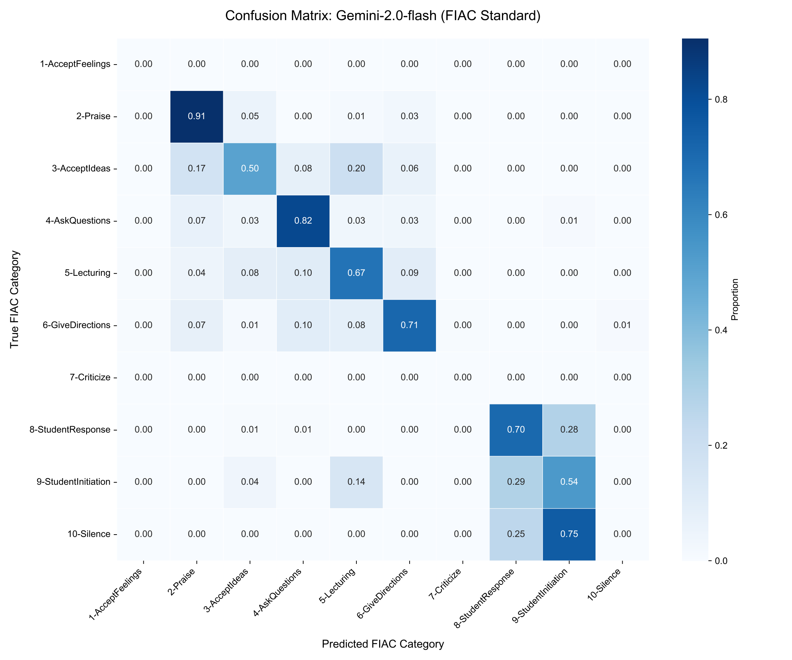
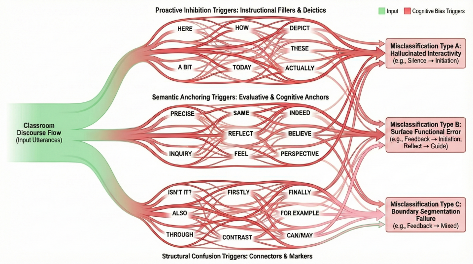

# DialogEval: A Cross-Framework Annotation Benchmark for Classroom Dialogue

<p align="center">
  
</p>

<p align="center">
  <b>Evaluating whether large language models can reason <i>between</i>, <i>behind</i>, and <i>beyond</i> the words in classroom dialogue.</b><br/>
  <sub>Supplementary materials for an anonymous ACL 2026 submission.</sub>
</p>

<p align="center">
  <a href="https://acl-dialogeval.github.io/benchmark/">
    
  </a>
  <a href="https://github.com/ACL-DialogEval/DialogEval-Supplementary-Material">
    
  </a>
  
</p>

---

## 🔍 Overview

**DialogEval** is a diagnostic benchmark for **Automated Classroom Dialogue Encoding (ACDE)**.  
Rather than focusing solely on label accuracy, DialogEval evaluates whether large language models (LLMs) can perform the **inferential reasoning** required to interpret authentic classroom discourse.

Classroom dialogue is sequential, intention-driven, and norm-governed.  
Surface-form similarity often masks fundamentally different discourse functions.  
DialogEval is designed to expose where and why models fail under such conditions.

---

## 🧠 The Three Bs Framework

DialogEval introduces a unified **Three Bs** analytical lens that organizes discourse understanding by increasing cognitive demand:

- **Between the Words**  
  Logical boundaries, contextual dependency, and sequential structure  
- **Behind the Words**  
  Latent pedagogical intent and discourse roles  
- **Beyond the Words**  
  Domain norms, cultural expectations, and instructional conventions  

<p align="center">
  
</p>

The framework is applied across three established classroom discourse schemes:

- **FIAC**
- **IRF**
- **SEDA**

---

## 🧪 Benchmark Design

DialogEval is a **cross-framework annotation benchmark** with the following principles:

- **Context-aware annotation**  
  Target utterances are labeled within bounded sliding windows to preserve local discourse structure.
- **Prompting hierarchy**  
  Multiple prompting strategies probe reasoning behavior under varying instructional scaffolds.
- **Diagnostics-first evaluation**  
  Emphasis on systematic error patterns rather than leaderboard-style ranking.

<p align="center">
  
</p>

---

## 🧩 Prompting Strategies

DialogEval implements a hierarchical prompting design:

- **P1 – Vanilla (zero-shot)**  
  Label options only  
- **P2 – Definition (zero-shot)**  
  Label options with category definitions  
- **P3 – Expert Manual (few-shot)**  
  Scenario-based guidance inspired by annotation manuals  
- **P4 – Chain-of-Thought (CoT)**  
  Explicit reasoning paths for labeling decisions  

<p align="center">
  
</p>

---

## 📊 Diagnostic Evidence: Confusion Matrices

Representative confusion matrices illustrate **systematic misclassification patterns**.

<p align="center">
  <a href="dialogeval_assets/cm_fiac_gemini.png">
    
  </a>
  <a href="dialogeval_assets/cm_irf_deepseek.png">
    
  </a>
</p>

<p align="center">
  <a href="dialogeval_assets/cm_irf_qwen.png">
    
  </a>
  <a href="dialogeval_assets/cm_seda_innospark.png">
    
  </a>
</p>

<p align="center">
  <a href="dialogeval_assets/cm_seda_educhat.png">
    
  </a>
</p>

---

## 🩸 Capillary Diagnostics: Lexical Triggers

DialogEval introduces **capillary diagnostics** to trace how local lexical or structural cues propagate into systematic errors.

Observed patterns include:

- Hallucinated interactivity triggered by fillers and deixis  
- Semantic anchoring effects overriding discourse function  
- Boundary segmentation failures induced by connectors and discourse markers  

<p align="center">
  
</p>

A compiled appendix of prominent lexical triggers (“lure words”) is provided:

- `dialogeval_assets/appendix_lure_words.pdf`

---

## 📁 Repository Contents

```text
.
├── dialogeval_assets/
│   ├── fig1_3b_framework.png
│   ├── fig2_sliding_window.png
│   ├── fig3_prompt_hierarchy_example.png
│   ├── fig4_capillary_sankey.png
│   ├── cm_fiac_gemini.png
│   ├── cm_irf_deepseek.png
│   ├── cm_irf_qwen.png
│   ├── cm_seda_educhat.png
│   ├── cm_seda_innospark.png
│   └── appendix_lure_words.pdf
├── Prompt_FIAC.py
├── Prompt_IRF_cot.py
├── Prompt_SEDA.py
├── Analysis_FIAC.py
├── Classroom Dialogue Example*
├── index.html
└── README.md
